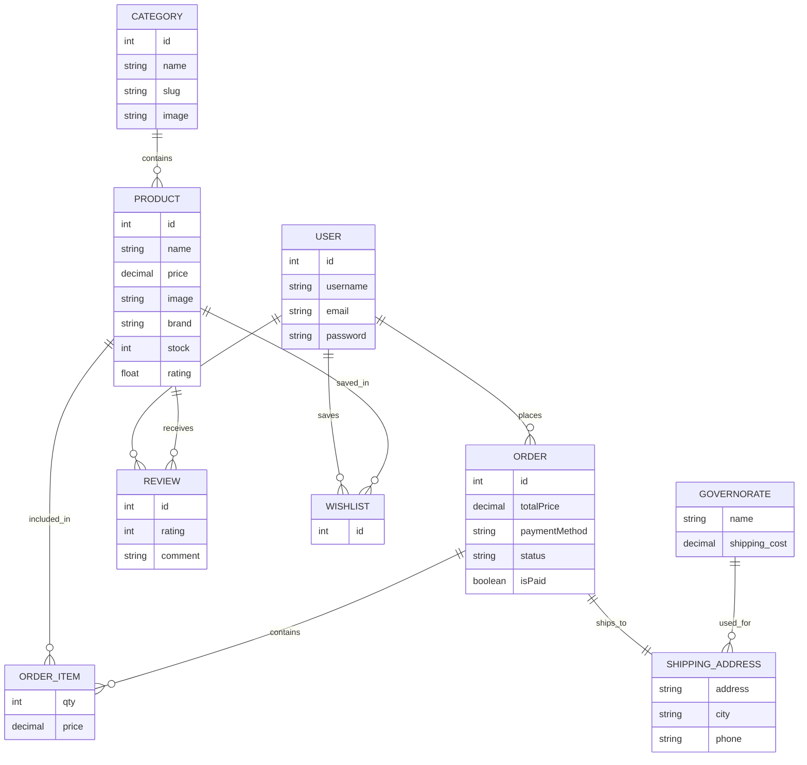

# Muslima Boutique — Modest Fashion E-Commerce

Muslima Boutique is a premium full-stack modest fashion e-commerce platform focused on elegant Islamic women's clothing including abayas, hijabs, niqabs, skirts, and modest wear collections.

The platform is designed with a luxury boutique aesthetic using a modern React + Django architecture, featuring bilingual Arabic/English support, JWT authentication, wishlist management, checkout flow, order tracking, and a complete admin dashboard.

---

# Live Demo

### Frontend Website

[Add your deployed Vercel link here]

Example:
https://muslima-boutique.vercel.app

---

### Backend API

[Add your deployed backend link here]

Example:
https://muslima-api.onrender.com

---

# Screenshots

## Homepage


---

## Products Page


---

## Product Details


---

## Checkout


---

## Admin Dashboard


---

# Features

* Full-stack React + Django architecture
* JWT Authentication
* Arabic / English bilingual support
* RTL / LTR layouts
* Wishlist system
* Dynamic categories
* Search & filtering
* Checkout & shipping system
* Egyptian governorates shipping support
* Order tracking system
* Django admin dashboard
* Responsive modern UI
* Luxury modest fashion design system
* Production-ready API architecture

---

# Tech Stack

## Frontend

* React
* Vite
* Tailwind CSS
* shadcn/ui
* React Router
* React Query
* Axios

## Backend

* Django
* Django REST Framework
* SimpleJWT Authentication
* PostgreSQL / SQLite
* Django Admin

---

# Project Structure

```bash
Muslima_E_Commerce_Website/
│
├── frontend/
│   ├── src/
│   ├── public/
│   └── package.json
│
├── backend/
│   ├── settings.py
│   ├── urls.py
│   └── wsgi.py
│
├── store/
│   ├── models.py
│   ├── views.py
│   ├── serializers.py
│   └── urls.py
│
├── screenshots/
│
└── README.md
```

---
# Database Schema




# API Endpoints

## Authentication

* POST `/api/users/login/`
* POST `/api/users/register/`

## Products

* GET `/api/products/`
* GET `/api/products/:id/`

## Categories

* GET `/api/categories/`

## Orders

* POST `/api/orders/add/`
* GET `/api/orders/myorders/`
* GET `/api/orders/:id/`

## Wishlist

* GET `/api/wishlist/`

---

# Local Installation

## Backend Setup

```bash
python -m venv venv
venv\Scripts\activate

pip install -r requirements.txt

python manage.py migrate

python manage.py runserver 8080
```

Backend runs on:

```bash
http://127.0.0.1:8080
```

---

## Frontend Setup

```bash
cd frontend

npm install

npm run dev
```

Frontend runs on:

```bash
http://localhost:5173
```

---

# Environment Variables

## Frontend `.env`

```env
VITE_API_URL=http://127.0.0.1:8080
```

---

## Backend `.env`

```env
DEBUG=True
SECRET_KEY=your_secret_key
ALLOWED_HOSTS=127.0.0.1,localhost
```

---

# Deployment

## Frontend Deployment (Vercel)

* Import GitHub repository into Vercel
* Set Root Directory:

```bash
frontend
```

* Add Environment Variable:

```env
VITE_API_URL=https://your-backend-url.onrender.com
```

---

## Backend Deployment (Render / Railway)

Required Environment Variables:

```env
DEBUG=False
SECRET_KEY=your_production_secret
ALLOWED_HOSTS=your-backend-domain.onrender.com
DATABASE_URL=your_postgresql_url
```

Start Command:

```bash
gunicorn backend.wsgi:application
```

---

# Admin Dashboard

Admin panel available at:

```bash
http://127.0.0.1:8080/admin
```

The dashboard allows:

* product management
* category management
* order tracking
* order status updates
* customer reviews management

---

# Future Improvements

* Product variants (size/color)
* Online payment integration
* Advanced analytics dashboard
* Email notifications
* Coupons & discount system
* Product recommendations

---

# Author

Developed by Shada Khaled

GitHub:
https://github.com/shadaneutron
